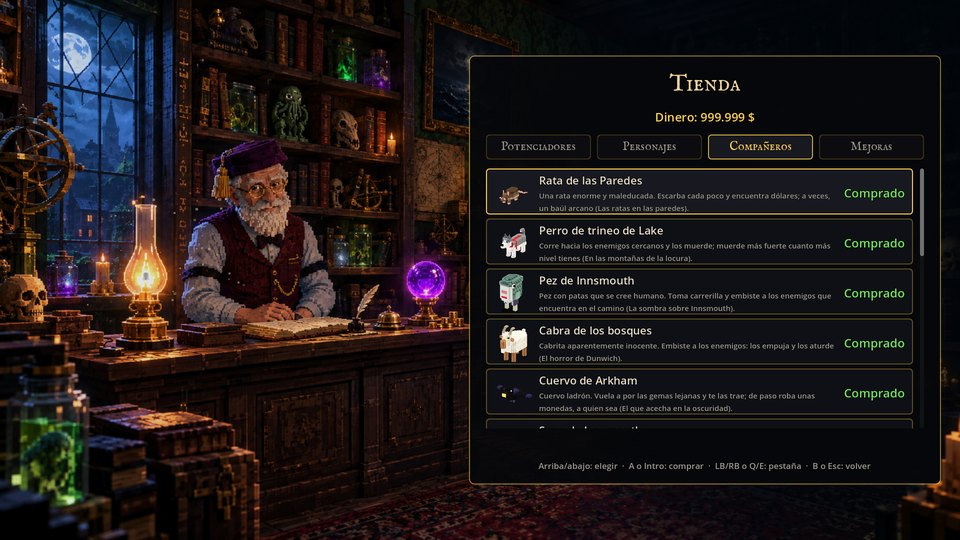
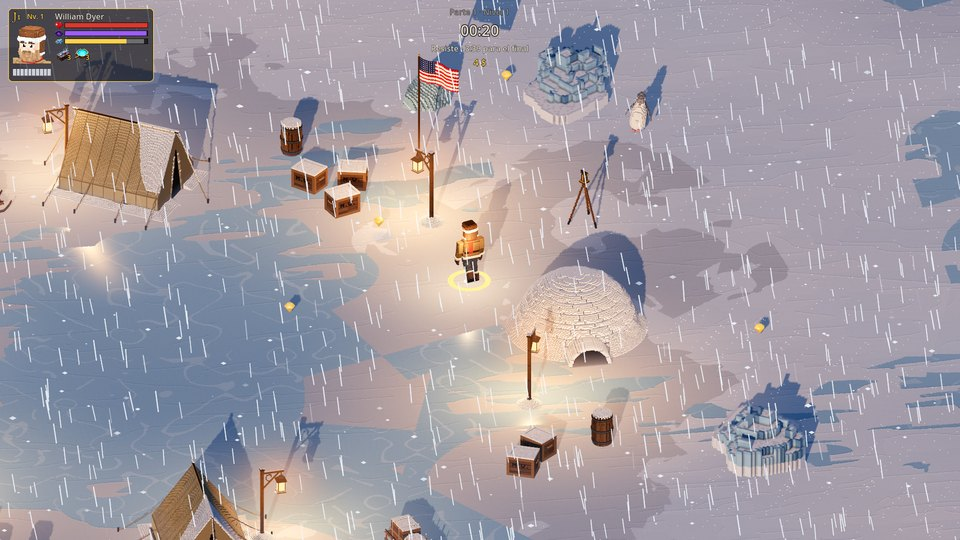
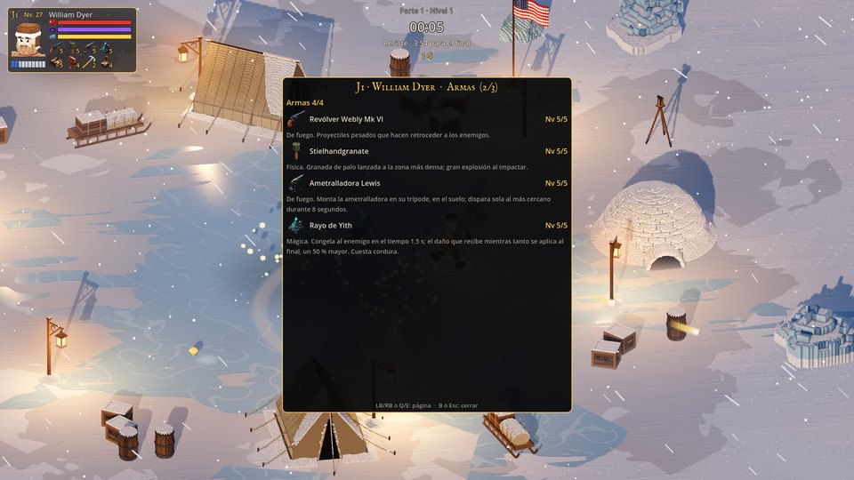
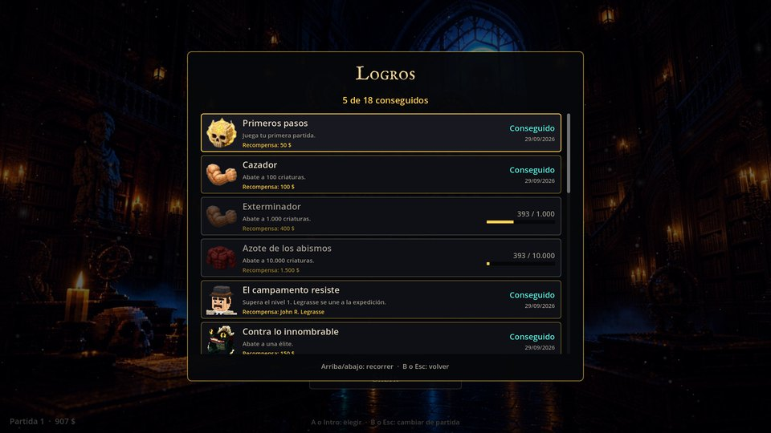
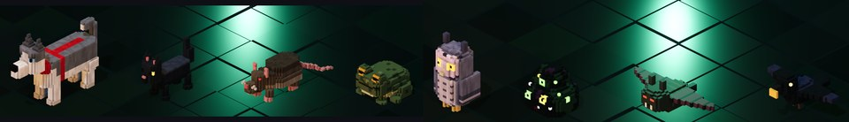
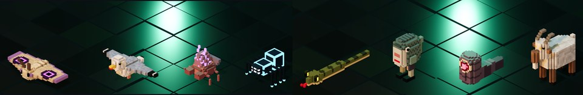
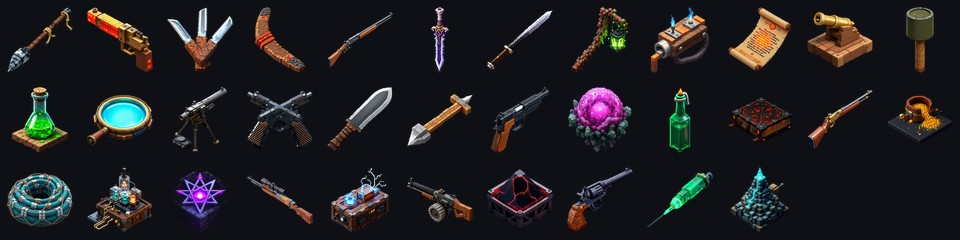

<div align="center">

# Lovecraft Library: Surviving Cthulhu

**Bullet hell isométrico en voxel 3D, con disparo automático y progresión *survivors*, para 1–4 jugadores en cooperativo local, ambientado en los mitos de H. P. Lovecraft.**


[](LICENSE)

</div>

Un grupo de investigadores sacados de los relatos de Lovecraft atraviesa los escenarios de tres historias (*En las montañas de la locura*, *La sombra sobre Innsmouth* y *La llamada de Cthulhu*), enfrentándose a horrores cada vez más antiguos hasta despertar al propio Cthulhu. Las armas disparan solas: la habilidad está en **moverse y esquivar** entre cortinas de balas que dañan la **vida** o la **cordura**.

<div align="center">


</div>

> [!NOTE]
> **Proyecto en desarrollo.** La fase 1 (prototipo jugable) está cerrada y la fase 2 (menús, guardado y cooperativo local) está casi terminada. Hoy se juega de principio a fin el primer nivel, solo o con hasta cuatro jugadores, con once personajes, quince compañeros, tienda y logros. El estado detallado está en la [hoja de ruta](docs/ROADMAP.md).

## Índice

- [Características](#características)
- [Capturas](#capturas)
- [Personajes](#personajes)
- [Compañeros](#compañeros)
- [Armas y objetos](#armas-y-objetos)
- [Bestiario](#bestiario)
- [Cómo se juega](#cómo-se-juega)
- [La campaña](#la-campaña)
- [Instalación y ejecución](#instalación-y-ejecución)
- [Para desarrolladores](#para-desarrolladores)
- [Hoja de ruta](#hoja-de-ruta)
- [Derechos y créditos](#derechos-y-créditos)
- [Licencia](#licencia)

## Características

**Jugabilidad**
- **Bullet hell + survivors:** hordas que aparecen fuera de cámara, patrones de balas definidos como datos y armas que disparan solas. Cada nivel termina con un evento final (en el nivel 1, el Acechador).
- **Dos recursos, tres tipos de daño:** la vida y la **cordura**. Los ataques físicos (rojos, naranjas, amarillos) quitan vida; los mentales (morados, lilas), cordura; los mixtos, las dos. Con la cordura a cero llega una **crisis de locura**: parálisis, huida, vagar sin rumbo, delirio o paranoia.
- **34 armas** de fuego, físicas y mágicas, hasta 4 a la vez, y **objetos** pasivos. Los proyectiles se paran contra el decorado y heredan tu velocidad cuando disparas hacia donde corres.
- **Once personajes**, cada uno con siete atributos, arma inicial, un rasgo y su propio esquive (deslizarse, voltereta, plancha, salto o destello).
- **Cooperativo local de 1 a 4:** cámara compartida, experiencia común, subida de nivel por cuadrante sin pausar a los demás, reanimación de los caídos y dificultad que crece con los jugadores.
- **Quince compañeros** que acompañan, atacan, curan, se comen balas o encuentran dinero.
- **Clima** por nivel: nevada, ventisca, ceniza, lluvia, tormenta con rayos y niebla.

**Menús y progreso**
- Portada animada sobre una ilustración de la biblioteca: velas vivas, farolillos, niebla, ceniza, relámpagos y los ojos de Cthulhu.
- **Tres huecos de guardado**, **tienda de antigüedades** (potenciadores, personajes, compañeros y mejoras) y **18 logros** con recompensa.
- **Selección para cuatro jugadores a la vez:** cada uno se une con Start, maneja su ficha con su mando, gira el personaje y el compañero con los gatillos y elige.
- Ficha del personaje y mapa de la arena en partida, configuración completa (vídeo, audio, controles reasignables, accesibilidad) y menú de depuración.

**Técnica**
- Voxel 3D detallado (**48 voxels por metro** en personajes y compañeros), generado por código en Python y convertido en mallas con oclusión ambiental y caché en disco.
- Animación por partes, sin rigging, con capas y fundidos. Interpolación de física para monitores de más de 60 Hz.
- **Miles de balas sin un nodo por bala:** arrays compactos, rejilla espacial y MultiMesh. **150 enemigos y 1.200 balas a ~100 FPS** (1080p, RTX 3070 Ti).
- **Mapa de lo transitable a partir de los voxels reales** de cada pieza: se llega hasta el frente de los acantilados y el borde de la costa, y nadie atraviesa el decorado.
- Datos antes que código: personajes, armas, enemigos, patrones, niveles, compañeros, logros y artículos de la tienda son recursos `.tres` o JSON.

## Capturas

| | |
|:---:|:---:|
|  |  |
| **La horda.** Pingüinos albinos ciegos y fragmentos protoplásmicos en el campamento de la costa del mar de Ross, en cooperativo. | **El evento final.** El Acechador ronda, salta con aviso en el suelo y croa una onda mental. |
|  |  |
| **Selección.** Hasta cuatro jugadores eligen a la vez personaje y compañero, cada uno con su mando. | **La tienda de antigüedades,** con el anciano detrás del mostrador. |
|  |  |
| **Clima.** Lluvia y tormenta con rayos; cada nivel elige el suyo. | **La ficha** del personaje, en partida: atributos, armas y objetos. |
|  | |
| **Logros,** con su recompensa y su progreso. | |

## Personajes

Todos proceden de los relatos de Lovecraft, o son parientes o allegados inventados de sus personajes. Se empieza con cuatro (Dyer, Olmstead, Peaslee y Whipple); el resto se compra en la tienda o se consigue con logros.

Cada personaje tiene **siete atributos** (Poder, Inteligencia, Fuerza, Constitución, Tenacidad, Destreza y Cultura), todos a 10 más un reparto de 20 puntos según su historia. De ellos salen la vida, la cordura, el esquive, la velocidad y el daño de cada tipo de arma, y al subir de nivel ganan un punto más.


| Personaje | Arma inicial | Rasgo | Esquive |
|---|---|---|---|
| **William Dyer**, geólogo de la Miskatonic | Stielhandgranate | Explosiones un 25 % más grandes | Deslizamiento |
| **Robert Olmstead**, narrador de Innsmouth | Revólver Webly Mk VI | Esquive un 30 % más largo | Voltereta |
| **Amelia Peaslee**, arqueóloga | Rifle de palanca | Más suerte: a veces, una cuarta mejora para elegir | Voltereta |
| **Dra. Marian Whipple**, doctora | Bisturís | Reanima a los compañeros un 50 % más rápido | Salto |
| **John R. Legrasse**, inspector de Nueva Orleans | Escopeta de corredera | 25 % más de daño contra cultistas y humanos | Salto |
| **Gustaf Johansen**, oficial del *Emma* | Machete | 25 % más de daño cuerpo a cuerpo | Plancha |
| **Madame Ludmila Varga**, espiritista | Páginas del Necronomicón | Las armas arcanas le cuestan la mitad de cordura | Destello |
| **Henrietta Blake**, escritora | Trapezoedro Resplandeciente | 15 % más de experiencia | Deslizamiento |
| **Padre Iwanicki**, sacerdote | Fórmula de expulsión | Aura que calma: él y los compañeros cercanos recuperan cordura | Voltereta |
| **Sargento Frank Elwood**, veterano de la Gran Guerra | Pistola Mauser C96 | 15 % menos de daño físico | Plancha |
| **Vera Malone**, contrabandista de Red Hook | Subfusil Thompson M1928 | Hasta un 50 % más de daño cuanto más cerca está el enemigo | Deslizamiento |

## Compañeros

Cada jugador puede llevar uno. Suben de nivel con él y se consiguen en la tienda (el gato de Ulthar, también con un logro).




| Compañero | Qué hace |
|---|---|
| Perro de trineo de Lake | Corre a morder a los enemigos cercanos. |
| Gato de Ulthar | Araña a los que se acercan; si te hieren, se eriza y ataca el doble de rápido. |
| Rata de las Paredes | Escarba y encuentra dólares; a veces, un baúl arcano. |
| Sapo de Innsmouth | Escupe baba venenosa que deja un charco. |
| Búho de los sueños | Más experiencia por gema. |
| Shoggoth bebé | Se traga las balas enemigas que pasan cerca. |
| Mini-Byakhee | Cae en picado sobre los enemigos. |
| Cuervo de Arkham | Te trae las gemas lejanas y roba monedas. |
| Polilla de Leng | Suelta polvo que confunde: los enemigos vagan y no disparan. |
| Gaviota de Innsmouth | Trae pescado que cura vida y cordura; chilla al ver una élite. |
| Mini-Mi-Go | Dispara rayos. |
| Araña de Tíndalos | Se teletransporta detrás de un enemigo, muerde y aturde. |
| Serpiente de Yig | Muerde y envenena. |
| Pez de Innsmouth | Toma carrerilla y embiste. |
| Mini-Dhole | Excava y sale bajo los grupos de enemigos. |
| Cabra de los bosques | Embestida que aturde. |

## Armas y objetos



Todas disparan solas y cada una decide en sus datos cómo apunta: al más cercano, a la zona más densa, al más fuerte, alrededor del personaje… Suben de nivel del 1 al 5, y su daño crece con los atributos de su tipo.

<details>
<summary><b>Las 34 armas</b></summary>

| Arma | Tipo | Cómo funciona |
|---|---|---|
| Revólver Webly Mk VI | De fuego | Proyectiles pesados que hacen retroceder a los enemigos. |
| Escopeta de corredera | De fuego | Perdigones que se abren en anillo alrededor del personaje. |
| Rifle de palanca | De fuego | Disparos rápidos que atraviesan a varios enemigos. |
| Pistola Mauser C96 | De fuego | Ráfagas cortas de tres trazadoras. |
| Subfusil Thompson M1928 | De fuego | Ráfagas cerradas de proyectiles pequeños. |
| Flammenwerfer | De fuego | Chorro de fuego en cono que deja el suelo ardiendo. |
| Pistola de bengalas | De fuego | Bengala que atrae a los enemigos cercanos (las élites no caen). |
| Cañón de fuegos artificiales | De fuego | Cohetes erráticos que estallan en chispas. |
| Springfield M1903 con mira | De fuego | Disparo lento y fuerte que busca a la élite o al de más vida; a veces, crítico triple. |
| Ametralladora Lewis | De fuego | Torreta en trípode que dispara sola al más cercano. |
| Lugers P08 a dos manos | De fuego | Disparan a la vez hacia delante y hacia atrás. |
| Bobina Tesla portátil | De fuego | Rayo que salta de un enemigo a otro, hasta cuatro. |
| Stielhandgranate | Física | Granada de palo a la zona más densa; explota al impactar. |
| Cóctel Molotov | Física | Botella en arco que deja un charco en llamas. |
| Lanzaquímicos | Física | Frasco de ácido: los del charco reciben un 25 % más de daño. |
| Arpón ballenero | Física | Atraviesa y arrastra a los enemigos menores. |
| Machete | Física | Tajo circular alrededor del personaje. |
| Bisturís | Física | Abanico de hojas que atraviesan. |
| Bumerán | Física | Va y vuelve, golpeando a la ida y a la vuelta. |
| Red de pesca | Física | Inmoviliza al grupo más denso dos segundos. |
| Martillo de geólogo | Física | Grieta en línea que daña y aturde. |
| Bastón estoque | Física | Estocada larga que atraviesa todo lo que hay en la línea. |
| Inyector de Herbert West | Física | El que muere con el suero se levanta seis segundos como aliado. |
| Páginas del Necronomicón | Mágica | Páginas que orbitan alrededor del personaje. |
| Trapezoedro Resplandeciente | Mágica | Rayo de luz que daña todo lo que atraviesa. |
| Fórmula de expulsión | Mágica | Onda que empuja y aturde. |
| Signo Arcano | Mágica | Signo en el suelo que daña, empuja y frena las balas enemigas. |
| Resonador de Tillinghast | Mágica | Su pulso deshace las balas enemigas cercanas. |
| Báculo del Farolero | Mágica | Fuegos fatuos que buscan solos a los enemigos. |
| Lente del Éter | Mágica | Rayo sostenido cuyo daño crece hasta el triple. |
| Polvo de Ibn-Ghazi | Mágica | Nube que ralentiza y debilita. |
| Orbe Mi-Go | Mágica | Orbe que vuela a tu alrededor y dispara solo. |
| Rayo de Yith | Mágica | Congela en el tiempo; el daño se aplica al final, un 50 % mayor. |
| Daga ritual | Mágica | Maldición que salta a los de al lado si el enemigo muere maldito. |

Las mágicas cuestan cordura.

</details>

**Objetos** (de la subida de nivel y de la tienda):


## Bestiario


| Criatura | Escalón | Comportamiento | Ataque |
|---|---|---|---|
| **Pingüino albino ciego** | 1 | Va hacia donde oyó al jugador y embiste. Es la masa de la horda. | Cuerpo a cuerpo (físico) |
| **Fragmento protoplásmico de shoggoth** | 1 | Repta a tirones y se para a escupir. | Glóbulos que silban "¡Tekeli-li!" (mixto) |
| **Acechador** (élite) | 3 | Ronda, salta con aviso y croa; su presencia drena cordura. | Salto con anillo de balas (físico) y onda mental |

Cada nivel añade criaturas nuevas sin retirar las anteriores. Las de escalón bajo aparecen en mayor número, y la horda es sobre todo de cuerpo a cuerpo: los que disparan son pocos.

## Cómo se juega

### Controles

| Acción | Mando | Teclado |
|---|---|---|
| Moverse | Stick izquierdo o cruceta | WASD o flechas |
| Esquivar | A | Espacio |
| Disparar | Automático | Automático |
| Ficha del personaje | Select | Tab |
| Mapa de la arena | Cruceta abajo | M |
| Páginas de la ficha / girar en la selección | LB / RB | Q / E |
| Pausa | Start | Esc |
| Menús: confirmar / volver | A / B | Intro / Esc |
| Selección: unirse | Start | Intro |

Todo se puede reasignar, en teclado y en mando, desde **Configuración → Controles**.

### Vida, cordura y locura

- **Vida:** baja con el daño físico. En cooperativo, a cero quedas derribado 30 s y un compañero puede reanimarte.
- **Cordura:** baja con los ataques mentales, la presencia de los horrores y las armas arcanas. Se recupera lejos de los enemigos, más rápido junto a un farol o a un compañero.
- **Crisis de locura:** con la cordura a cero llega una de cinco crisis (parálisis, huida histérica, vagar sin rumbo, delirio con los controles invertidos o paranoia, solo en cooperativo). Un compañero cerca la acorta.
- **Legibilidad:** los efectos de cordura baja nunca ocultan ni falsean las balas reales.

## La campaña

Tres partes de cinco niveles, cada una con su jefe:

| Parte | Relato | Escenario | Jefe |
|---|---|---|---|
| 1 | *En las montañas de la locura* | La Antártida: del campamento base a los túneles del mar subterráneo | El shoggoth primigenio |
| 2 | *La sombra sobre Innsmouth* | Nueva Inglaterra: de Newburyport a Y'ha-nthlei | Padre Dagon |
| 3 | *La llamada de Cthulhu* | Providence, los pantanos de Luisiana y el Pacífico | Cthulhu |

Hoy se puede jugar el **nivel 1: el campamento base en la costa del mar de Ross**.

## Instalación y ejecución

**Desde el código**

Requisitos: [Godot 4.4.1](https://godotengine.org/download/archive/4.4.1-stable/) (versión estándar, no .NET) y una tarjeta gráfica con Vulkan (en Mac, Metal). Opcional, para regenerar modelos, arenas e iconos: Python 3.12 con `numpy`, `scipy` y `Pillow`.

```bash
git clone https://github.com/sergiosanchezcustodio/lovecraft-bullethell.git
cd lovecraft-bullethell
godot --headless --path . --import   # la primera vez: importa los recursos
godot --path .                       # portada → huecos → menú principal → selección → nivel
```
En Windows también basta con hacer doble clic en `jugar.cmd`. El juego arranca a pantalla completa; para jugar en ventana, `godot --path . -- window=true`.

**Ejecutables**

Con las plantillas de exportación de Godot 4.4.1 instaladas:

```bash
godot --headless --path . --export-release "Windows Desktop" builds/windows/LovecraftLibrary.exe   # un solo .exe (~206 MB)
godot --headless --path . --export-release "macOS" builds/macos/LovecraftLibrary.zip               # .app universal (~117 MB)
```

La versión de Mac no está firmada con una cuenta de desarrollador de Apple: la primera vez hay que abrirla con **clic derecho → Abrir**, o quitarle la cuarentena con `xattr -cr "Lovecraft Bullet Hell.app"`.

## Para desarrolladores

### Estructura

```
data/        Datos del juego: personajes, armas, enemigos, patrones, niveles, arenas, compañeros,
             mejoras, tienda, logros, clima y campaña
docs/        GDD, hoja de ruta, mediciones de rendimiento e imágenes de este README
models/      Modelos voxel en JSON (los generan los scripts de tools/)
resources/   Ilustraciones, máscaras de animación, iconos, música y fuentes
scenes/      Escenas: main (enrutador), title, select, game, preview y bench
scripts/     Código por sistema: anim, bullets, core, enemies, fx, input, level, menus, pets,
             player, progression, save, title, ui, weapons
tests/       Tests de GUT
tools/       Generadores de modelos, arenas, máscaras e iconos en Python
```

### Pipeline de arte voxel

1. **Generador en Python** (`tools/gen_*.py`, sobre `tools/voxlib.py`): construye el modelo con tramos de caras planas (`tools/cuerpo.py` para los humanos), lo colorea con texturas por material y pinta los detalles.
2. **JSON** (`models/*.json`): lista de voxels `[x, y, z, parte, r, g, b, glow]` y un pivote por parte.
3. **`VoxelBuilder`** convierte el JSON en mallas: quita las caras ocultas, calcula la oclusión ambiental por vértice, separa la capa emisiva y guarda el resultado en una caché en disco.
4. **Animación por código:** cada tipo de modelo tiene su script en `scripts/anim/`, que gira las partes según la fase de la animación.

```bash
python tools/gen_dyer.py                              # regenera un personaje
python tools/gen_arena_campamento.py                  # arena del nivel 1 y su mapa de lo transitable
godot --path . -- still 0 dyer,olmstead,legrasse      # captura de uno o varios modelos
godot --path . -- anim 45 dyer walk                   # fotogramas de una animación
```

### Opciones de ejecución

Las escenas leen lo que va detrás de `--`. Algunas útiles:

```bash
godot --path . -- title                               # portada
godot --path . -- select join=3                       # selección con tres jugadores de prueba
godot --path . -- bots=3 pet=shoggoth                 # partida con tres jugadores automáticos y un compañero
godot --path . -- bot=circle autopick=true shots=10   # bot automático y captura a los 10 s
godot --path . --disable-vsync -- bot=circle god=true max_alive=150 spawn_rate=40 bullet_rain=1200 perf=10
                                                      # prueba de carga
```
La lista completa está en [`CLAUDE.md`](CLAUDE.md). En partida, **Pausa → Depuración** permite cambiar casi todo sin reiniciar.

### Tests

```bash
godot --headless --path . -s addons/gut/gut_cmdln.gd
```
Hay 249 tests con [GUT 9.4](https://github.com/bitwes/Gut): movimiento, combate, balas, oleadas, progresión, cordura, cooperativo, compañeros, economía, tienda, logros, guardado, configuración, menús y animaciones. Lo visual se comprueba con capturas automáticas desde la terminal.

### Rendimiento

| Prueba (1920 × 1080, RTX 3070 Ti, 30-09-2026) | Media | 1 % peor |
|---|---|---|
| 150 enemigos y 1.200 balas, con la arena completa | ~100 FPS | ~55 FPS |
| Portada animada | 0,4 ms por fotograma | — |

El detalle está en [`docs/RENDIMIENTO.md`](docs/RENDIMIENTO.md).

### Documentación

- [`docs/GDD.md`](docs/GDD.md): documento de diseño vivo, con todas las decisiones.
- [`docs/ROADMAP.md`](docs/ROADMAP.md): fases, hitos, criterios de aceptación y estado.
- [`CLAUDE.md`](CLAUDE.md): estado actual, arquitectura, pipeline, comandos y lecciones técnicas aprendidas.
- [`docs/PROMPT_juego_lovecraft.md`](docs/PROMPT_juego_lovecraft.md): la especificación original, sin cambios.

### Imágenes de este README

Se rehacen con capturas automáticas del juego y con `python tools/montar_readme.py`, que las reduce a 960 px y monta las láminas de modelos y de iconos leyendo las mismas carpetas que usa el juego.

## Hoja de ruta

| Fase | Contenido | Estado |
|---|---|---|
| 0 | Documentación y decisiones | ✅ Hecha |
| 1 | Prototipo jugable: un jugador, un nivel, armas, enemigos, progresión, cordura, HUD | ✅ Hecha |
| 2 | Menús, guardado y cooperativo local: huecos, configuración, selección, 11 personajes, 34 armas, partida a 4, reanimación, cordura completa, economía, tienda, compañeros, logros, clima | 🔨 Casi terminada (falta el vestuario) |
| 3 | Pipeline de contenido: añadir enemigos y niveles solo con datos | ⏳ |
| 4 | Parte 1 completa: cinco niveles y el shoggoth primigenio | ⏳ |
| 5 | Arranque, relatos entre niveles y ampliación de la tienda | ⏳ |
| 6 | Parte 2 completa: Innsmouth y Padre Dagon | ⏳ |
| 7 | Parte 3 completa: R'lyeh y Cthulhu | ⏳ |
| 8 | Pulido, audio, accesibilidad y distribución | ⏳ |
| 9 | Juego online | ⏳ |
| 10 | Guardado en la nube | ⏳ |

## Derechos y créditos

- **Ambientación:** los relatos de H. P. Lovecraft son de **dominio público** en España y la Unión Europea, y todo el contenido del juego procede de ellos. El juego no usa la marca *Call of Cthulhu* (Chaosium) ni reproduce reglas, textos o ilustraciones del juego de rol ni de adaptaciones modernas.
- **Motor:** [Godot Engine](https://godotengine.org/) (licencia MIT).
- **Tests:** [GUT](https://github.com/bitwes/Gut) (licencia MIT), en `addons/gut/`.
- **Fuente de la portada:** *IM FELL English SC*, de Igino Marini, con licencia [SIL Open Font License 1.1](resources/fonts/OFL_IMFellEnglishSC.txt).
- **Diseño, ilustraciones y música:** Sergio Sánchez Custodio.
- **Uso de IA:** el código, los modelos voxel y la documentación se desarrollan con la ayuda de [Claude Code](https://claude.com/claude-code) (Anthropic). Los iconos de las armas y los objetos se generaron con FLUX 1.1 Pro a través de [Replicate](https://replicate.com/).

## Licencia

Este proyecto se distribuye bajo la **GNU General Public License v3.0**. Texto completo en [`LICENSE`](LICENSE).

En corto: puedes copiar, ejecutar, modificar y redistribuir el código, incluso con fines comerciales, siempre que cualquier versión modificada que redistribuyas se publique también bajo GPL-3.0 y con el código fuente disponible.

La licencia cubre el código y el arte original del proyecto. Las piezas de terceros incluidas conservan su propia licencia (Godot y GUT, MIT; la fuente IM FELL, SIL OFL 1.1), y la licencia no concede derechos sobre marcas de terceros.
