<div align="center">

# Lovecraft Library: Surviving Cthulhu

**Bullet hell isométrico en voxel 3D, con disparo automático y progresión *survivors*, para 1–4 jugadores en cooperativo local, ambientado en los mitos de H. P. Lovecraft.**

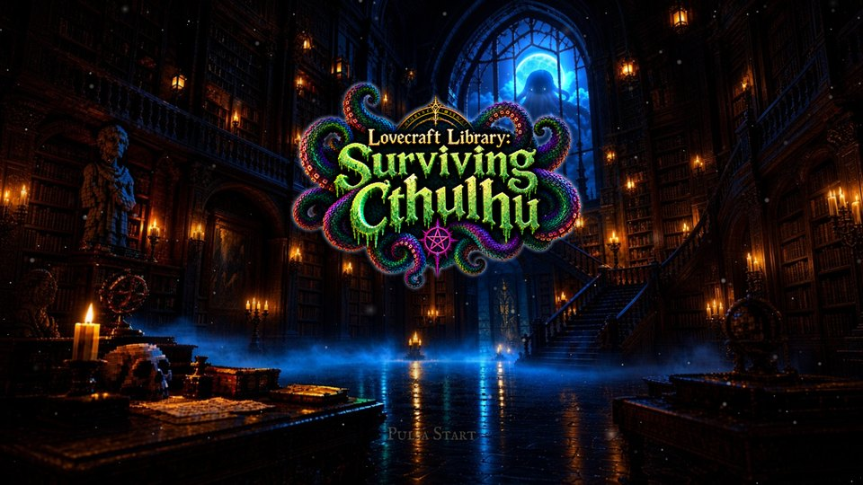


</div>

Un grupo de investigadores sacados de los relatos de Lovecraft atraviesa los escenarios de tres historias (*En las montañas de la locura*, *La sombra sobre Innsmouth* y *La llamada de Cthulhu*), enfrentándose a horrores cada vez más antiguos hasta despertar al propio Cthulhu. Las armas disparan solas: la habilidad está en **moverse y esquivar** entre cortinas de balas que dañan la **vida** o la **cordura**.

<div align="center">

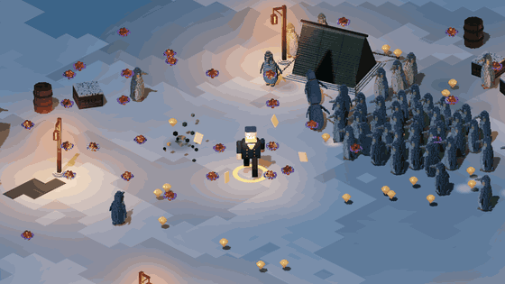

</div>

> [!NOTE]
> **Proyecto en desarrollo.** La fase 1 (prototipo jugable) está cerrada y la fase 2 (menús, guardado y cooperativo local) va por la mitad. Hoy se puede jugar de principio a fin el primer nivel, con once personajes, desde la portada hasta el final del nivel. El estado detallado está en la [hoja de ruta](docs/ROADMAP.md).

## Índice

- [Características](#características)
- [Capturas](#capturas)
- [Personajes](#personajes)
- [Armas](#armas)
- [Bestiario](#bestiario)
- [Cómo se juega](#cómo-se-juega)
- [La campaña](#la-campaña)
- [Instalación y ejecución](#instalación-y-ejecución)
- [Para desarrolladores](#para-desarrolladores)
- [Hoja de ruta](#hoja-de-ruta)
- [Derechos y créditos](#derechos-y-créditos)

## Características

**Jugabilidad**
- **Bullet hell + survivors:** hordas que aparecen fuera de cámara, patrones de balas definidos como datos y armas que disparan solas. Cada nivel termina con un evento final (en el nivel 1, el Acechador).
- **Dos recursos, tres tipos de daño:** la vida y la **cordura**. Los ataques físicos (rojos, naranjas, amarillos) quitan vida; los mentales (morados, lilas, violetas) quitan cordura; los mixtos, las dos. Con la cordura a cero llega una **crisis de locura**.
- **Esquive con personalidad:** cinco estilos (deslizarse por la nieve, voltereta, plancha, salto y destello), cada uno con su animación, impulso e invulnerabilidad.
- **Progresión dentro de la partida:** gemas de experiencia, subida de nivel con elección de 1 entre 3 mejoras (armas nuevas, subidas de arma y pasivas).
- **Once personajes jugables**, cada uno con arma inicial, rasgo, esquive y perfil propios.

**Menús y progreso**
- Portada animada sobre una ilustración de la biblioteca: velas vivas, farolillos que respiran, niebla, ceniza, relámpagos y los ojos de Cthulhu. El título entra desde la niebla.
- **Tres huecos de guardado** con tiempo jugado, objetos, compañeros y dinero. El formato está versionado y preparado para la nube.
- Menú principal, **configuración** completa (vídeo, audio, controles reasignables de teclado y mando, accesibilidad) y **menú de depuración** en la pausa.
- **Selección de personaje para cuatro jugadores a la vez:** cada uno se une con Start, maneja su marco con su mando, gira el modelo con LB/RB y elige compañero. Un personaje elegido no puede cogerlo otro.
- Mapa de la campaña con los 15 niveles.

**Técnica**
- Voxel 3D detallado (**32 voxels por metro**), generado por código en Python y convertido en mallas con oclusión ambiental por vértice y caché en disco.
- Animación por partes, sin rigging, con capas y fundidos. Interpolación de física para que todo se mueva suave en monitores de más de 60 Hz.
- **Miles de balas sin un nodo por bala:** arrays compactos, rejilla espacial y MultiMesh. Prueba de carga: **150 enemigos y más de 1.000 balas a ~120 FPS** (1080p, RTX 3070 Ti).
- Entrada por jugador (teclado, cada mando o bot), sin mezclar dispositivos: la base del cooperativo local.
- Datos antes que código: personajes, armas, enemigos, patrones de balas, niveles, oleadas y mejoras son recursos `.tres` o JSON.

## Capturas

| | |
|:---:|:---:|
| 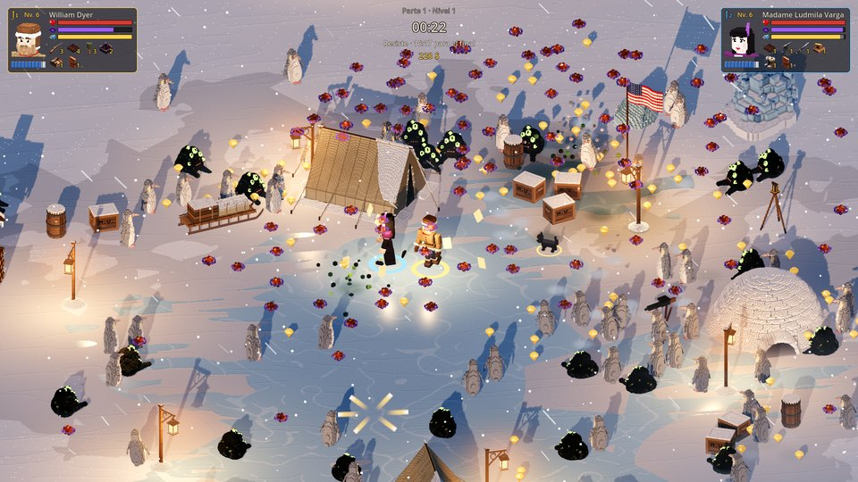 | 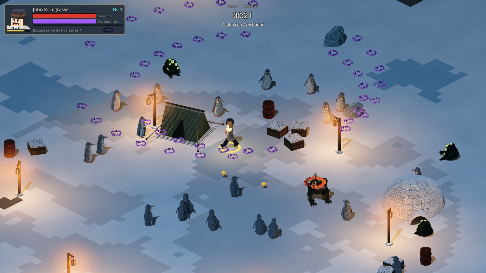 |
| **La horda.** Pingüinos albinos ciegos y fragmentos protoplásmicos en el campamento de la costa del mar de Ross. | **El evento final.** El Acechador ronda, salta con aviso en el suelo y croa una onda mental. |
| 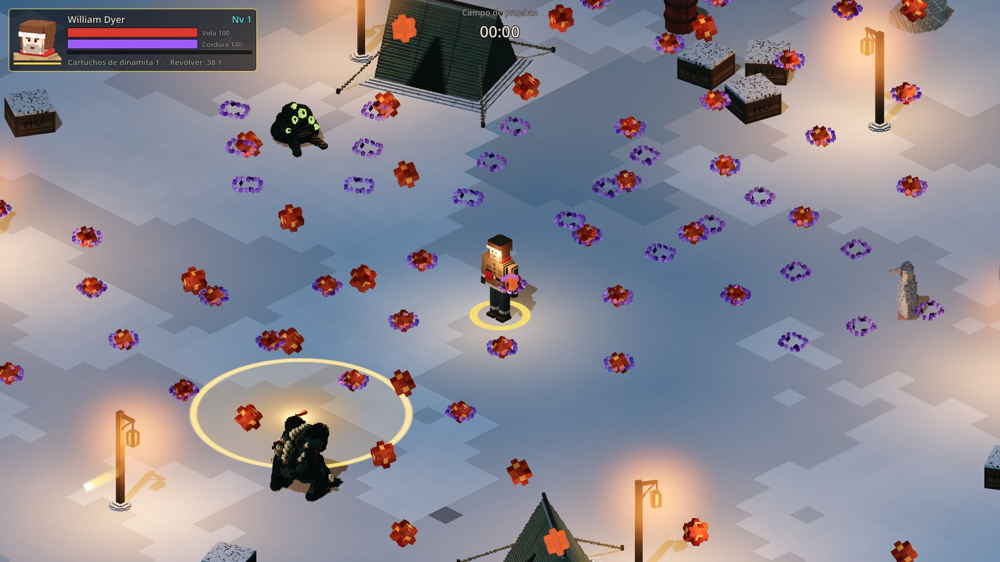 | 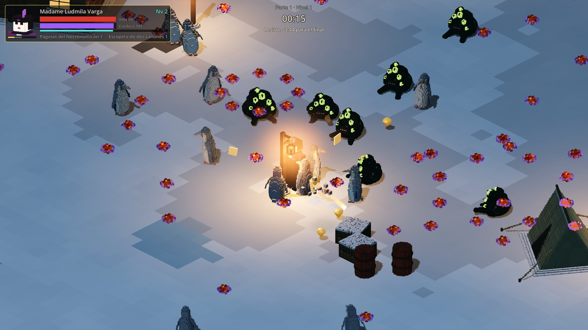 |
| **Lenguaje de daños.** Bolas rojas y naranjas quitan vida; anillos morados, cordura; el mixto combina los dos. Colores apagados para no marear. | **Armas arcanas.** Las páginas del Necronomicón de Madame Varga giran a su alrededor. Cada uso cuesta cordura. |
| 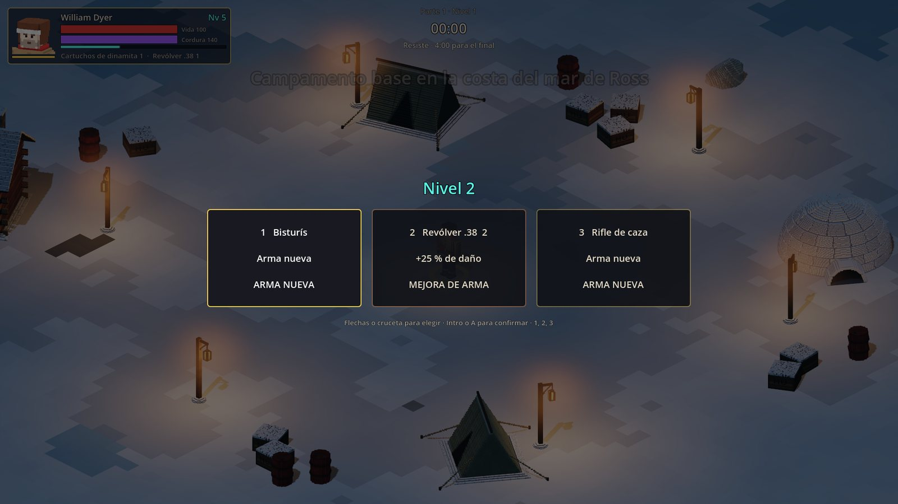 | 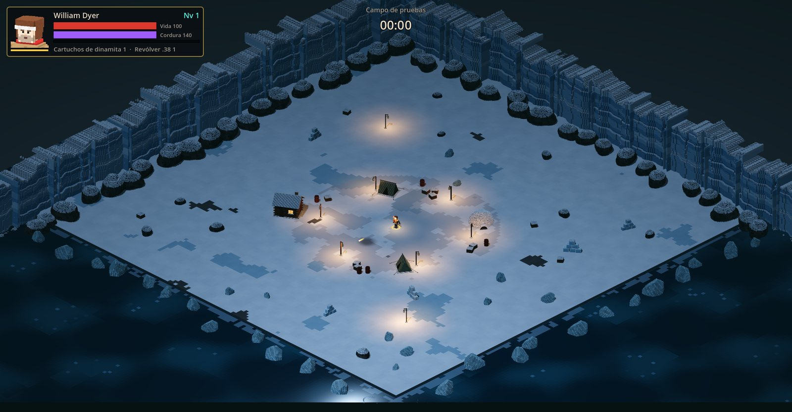 |
| **Subida de nivel.** Una mejora entre tres: arma nueva, subir un arma o una pasiva. | **La arena.** 64 × 64 m, cerrada por la Barrera de Ross al norte y al oeste y por el mar helado al sur y al este. |
| 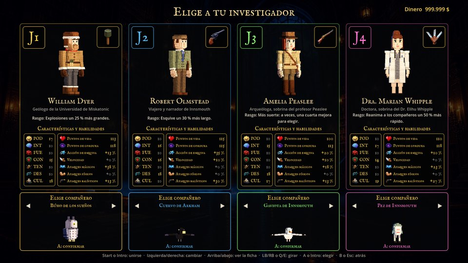 | 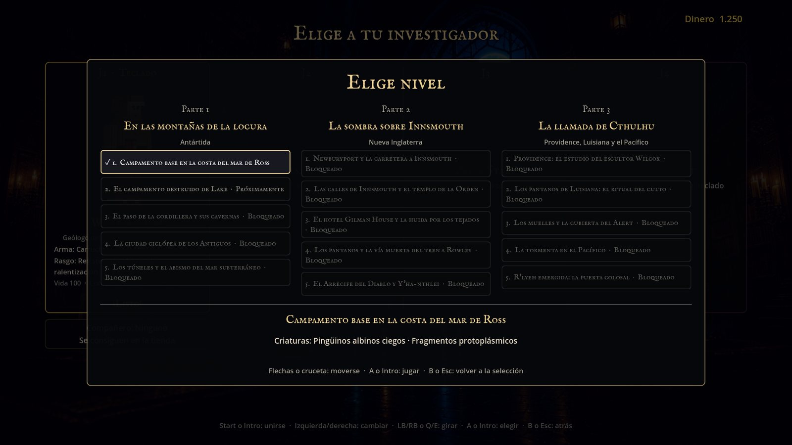 |
| **Selección de personaje.** Hasta cuatro jugadores eligen a la vez, cada uno con su mando. | **Mapa de niveles.** Tres partes de cinco niveles; se abren al superar el anterior. |
| 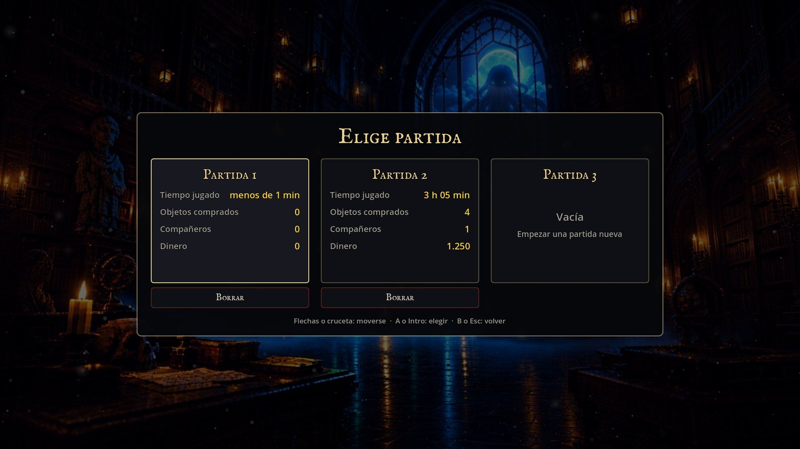 | 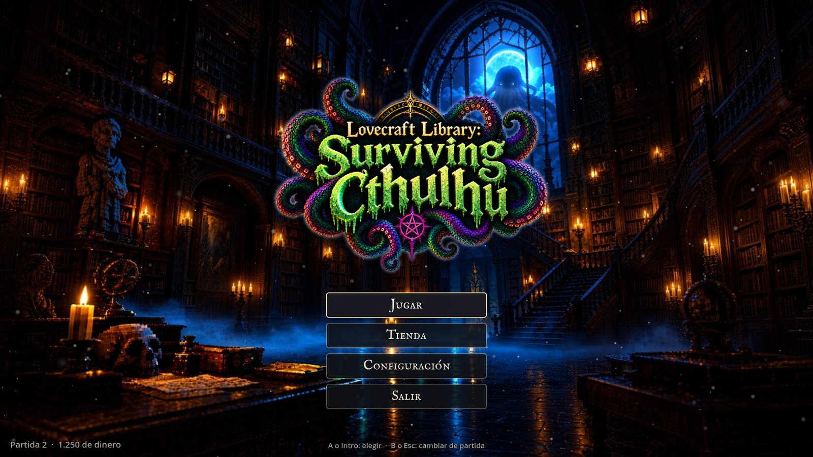 |
| **Tres huecos de partida,** con su resumen y borrado con confirmación. | **Menú principal** bajo el título. |
| 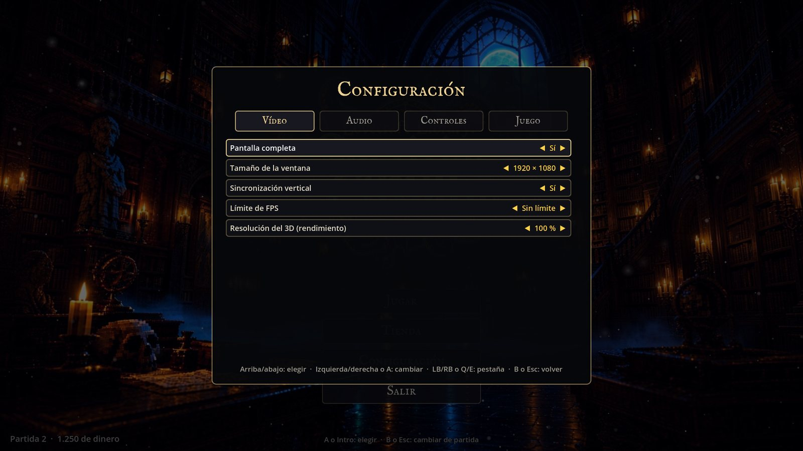 | 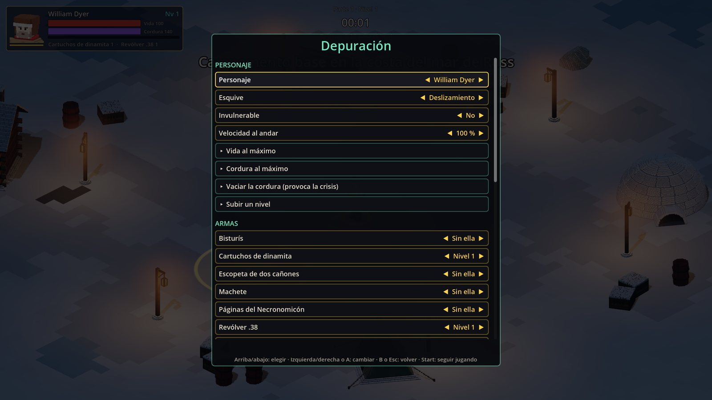 |
| **Configuración:** vídeo, audio, controles y juego. | **Depuración:** personaje, armas, pasivas, número de enemigos (10 a 300), velocidad del juego… |

## Personajes

Todos proceden de los relatos de Lovecraft, o son parientes o allegados inventados de sus personajes. Se modelan a **bloques limpios**, con los detalles pintados sobre superficies planas. Se empieza con cuatro (Dyer, Olmstead, Peaslee y Whipple); el resto se consigue en la tienda o jugando.

Cada personaje tiene **siete atributos** (Poder, Inteligencia, Fuerza, Constitución, Tenacidad, Destreza y Educación), todos a 10 más un reparto de 20 puntos según su historia. De ellos salen la vida, la cordura, el esquive, la velocidad y el daño de cada tipo de arma, y al subir de nivel ganan un punto más.

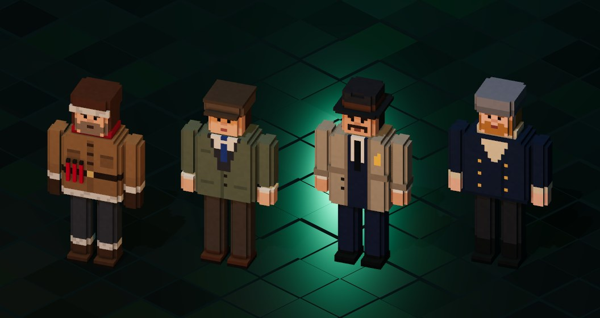

| Personaje | Relato | Arma inicial | Rasgo | Esquive |
|---|---|---|---|---|
| **William Dyer**, geólogo de la Miskatonic | *En las montañas de la locura* | Stielhandgranate | Resistencia al frío | Deslizamiento |
| **Robert Olmstead**, narrador de Innsmouth | *La sombra sobre Innsmouth* | Revólver Webly Mk VI | Esquive más largo; 30 % menos de daño de las criaturas marinas | Voltereta larga |
| **John R. Legrasse**, inspector de Nueva Orleans | *La llamada de Cthulhu* | Escopeta de corredera | 25 % más de daño a cultistas y humanos | Salto |
| **Gustaf Johansen**, oficial del *Emma* | *La llamada de Cthulhu* | Machete | Mucha vida; inmune al empuje | Plancha |

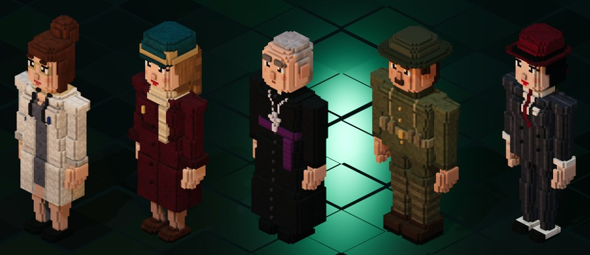

| Personaje | Relato | Arma inicial | Rasgo | Esquive |
|---|---|---|---|---|
| **Amelia Peaslee**, arqueóloga | *La sombra fuera del tiempo* | Rifle de palanca | Más suerte en las mejoras y recogida de gemas más amplia | Voltereta |
| **Madame Ludmila Varga**, espiritista | Médium de Arkham | Páginas del Necronomicón | Las armas arcanas le cuestan la mitad de cordura | Destello |
| **Dra. Marian Whipple**, doctora | *La casa maldita* | Bisturís | Se cura al subir de nivel y reanima más rápido | Salto |
| **Henrietta Blake**, escritora | *El morador de las tinieblas* | Trapezoedro Resplandeciente | 15 % más de experiencia | Deslizamiento |

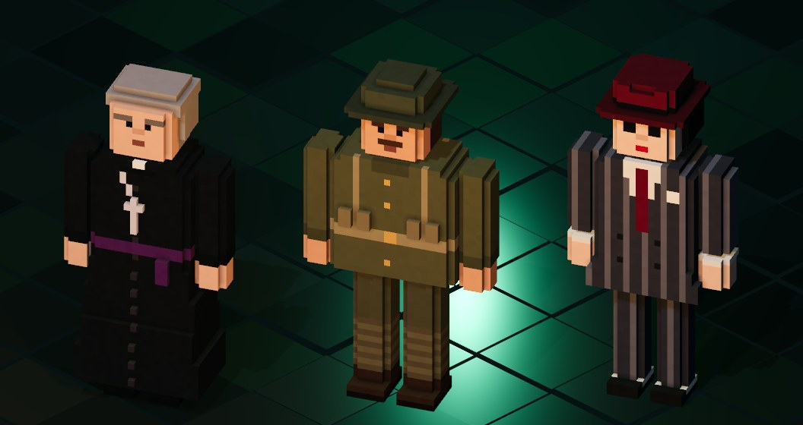

| Personaje | Relato | Arma inicial | Rasgo | Esquive |
|---|---|---|---|---|
| **Padre Iwanicki**, sacerdote | *Los sueños en la casa de la bruja* | Fórmula de expulsión | Su presencia calma: los compañeros cercanos recuperan cordura | Voltereta |
| **Sargento Frank Elwood**, veterano de la Gran Guerra | *Los sueños en la casa de la bruja* | Pistola Mauser C96 | Esquiva más a menudo y aguanta mejor el daño físico | Plancha |
| **Vera Malone**, contrabandista | *El horror de Red Hook* | Subfusil Thompson M1928 | Hasta un 50 % más de daño cuanto más cerca está el enemigo | Deslizamiento |

**Más adelante:** el profesor Armitage y Herbert West.

## Armas

Todas disparan solas y cada una decide en sus datos cómo apunta: al más cercano, a la zona más densa, alrededor del personaje… Suben de nivel del 1 al 5.

| Arma | Tipo | Cómo funciona |
|---|---|---|
| Revólver Webly Mk VI | De fuego | Proyectiles pesados que hacen retroceder a los enemigos. |
| Stielhandgranate | Física | Granada de palo lanzada a la zona más densa; gran explosión al impactar. |
| Escopeta de corredera | De fuego | Perdigones que se abren en anillo alrededor del personaje. |
| Rifle de palanca | De fuego | Disparos rápidos que atraviesan a varios enemigos. |
| Pistola Mauser C96 | De fuego | Ráfagas cortas de tres trazadoras. |
| Subfusil Thompson M1928 | De fuego | Ráfagas cerradas de proyectiles pequeños. |
| Flammenwerfer | De fuego | Chorro de fuego en cono que deja el suelo ardiendo. |
| Cóctel Molotov | Física | Botella en arco que crea un charco en llamas. |
| Arpón ballenero | Física | Proyectil pesado que atraviesa y arrastra a los enemigos menores. |
| Pistola de bengalas | De fuego | Bengala que ilumina y atrae a los enemigos cercanos (las élites no caen). |
| Lanzaquímicos | Física | Frasco de ácido: los enemigos del charco reciben un 25 % más de daño. |
| Cañón de fuegos artificiales | De fuego | Cohetes erráticos que estallan en chispas. |
| Machete | Física | Tajo circular alrededor del personaje; solo golpea si hay alguien cerca. |
| Bisturís | Física | Abanico de hojas que atraviesan. |
| Páginas del Necronomicón | Mágica | Páginas que orbitan alrededor del personaje. Cuesta cordura. |
| Trapezoedro Resplandeciente | Mágica | Rayo de luz concentrada que daña todo lo que atraviesa. Cuesta cordura. |
| Fórmula de expulsión | Mágica | Onda que se expande desde el personaje, empuja y aturde. Cuesta cordura. |

Cada arma es física, de fuego o mágica, y su daño crece con los atributos correspondientes. Llegan 17 armas más, arcanas y de los Mitos (rayos Tesla, orbes Mi-Go, el rayo de Yith, la daga ritual…).

## Bestiario

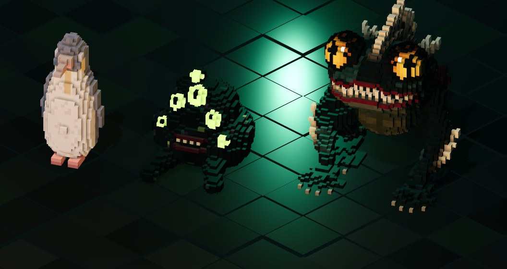

| Criatura | Escalón | Comportamiento | Ataque |
|---|---|---|---|
| **Pingüino albino ciego** | 1 | Va hacia donde oyó al jugador y corrige cada segundo; de cerca, embiste. Es la masa de la horda. | Cuerpo a cuerpo (físico) |
| **Fragmento protoplásmico de shoggoth** | 1 | Repta a tirones y se para a escupir. | Glóbulos que silban "¡Tekeli-li!" (mixto) |
| **Acechador** (élite) | 3 | Ronda a unos 6 m, salta con aviso y croa. | Salto con anillo de balas (físico) y onda de 30 balas con huecos (mental) |

Cada nivel añade dos criaturas nuevas de su escalón sin retirar las anteriores. Las de escalón bajo aparecen en mayor número (peso 2^(N−t)), y cada enemigo tiene además un peso propio: la horda es sobre todo de cuerpo a cuerpo y los que disparan son pocos.

## Cómo se juega

### Controles

| Acción | Mando | Teclado |
|---|---|---|
| Moverse | Stick izquierdo o cruceta | WASD o flechas |
| Esquivar | A | Espacio |
| Pausa | Start | Esc |
| Disparar | Automático | Automático |
| Menús: confirmar / volver | A / B | Intro / Esc |
| Selección: unirse | Start | Intro |
| Selección: girar el personaje | LB / RB | Q / E |

Moverse, esquivar, pausa, ficha y mapa se pueden reasignar, en teclado y en mando, desde **Configuración → Controles**.

### Vida, cordura y locura

- **Vida:** baja con el daño físico. A cero, el personaje cae. En cooperativo quedará derribado a la espera de que un compañero lo reanime.
- **Cordura:** baja con los ataques mentales, la presencia de los horrores y el uso de armas arcanas. Se recupera despacio lejos de los enemigos.
- **Crisis de locura:** con la cordura a cero, el personaje sufre una crisis temporal. Hoy está la **parálisis**: congelaciones breves avisadas con un temblor, durante las que sigue disparando. El diseño incluye cinco (huida, vagar sin rumbo, paranoia y delirio).
- **Legibilidad:** los efectos de cordura baja nunca ocultan ni falsean las balas reales.

## La campaña

Tres partes de cinco niveles, cada una con su jefe:

| Parte | Relato | Escenario | Jefe |
|---|---|---|---|
| 1 | *En las montañas de la locura* | La Antártida: del campamento base a los túneles del mar subterráneo | El shoggoth primigenio |
| 2 | *La sombra sobre Innsmouth* | Nueva Inglaterra: de Newburyport a Y'ha-nthlei | Padre Dagon |
| 3 | *La llamada de Cthulhu* | Providence, los pantanos de Luisiana y el Pacífico | Cthulhu |

Cada nivel es una arena de unas 3 × 3 pantallas, cerrada por su propio decorado, en la que hay que sobrevivir a las oleadas hasta el evento final. Hoy se puede jugar el **nivel 1: el campamento base en la costa del mar de Ross**.

## Instalación y ejecución

**Requisitos**
- [Godot 4.4.1](https://godotengine.org/download/archive/4.4.1-stable/) (versión estándar, no .NET).
- Windows 10 u 11 y una tarjeta gráfica con Vulkan (renderizador Forward+).
- Opcional, para regenerar modelos y máscaras: Python 3.12 con `numpy`, `scipy` y `Pillow`.

**Jugar**
```bash
git clone https://github.com/sergiosanchezcustodio/lovecraft-bullethell.git
cd lovecraft-bullethell
godot --headless --path . --import   # la primera vez: importa los recursos y crea la caché de clases
godot --path .                       # portada → partida → menú principal → selección → nivel
```
En Windows también basta con hacer doble clic en `jugar.cmd` (usa `C:\Tools\Godot\` o el `godot` del PATH).

El juego arranca a pantalla completa. Para jugar en ventana: `godot --path . -- window=true`.

## Para desarrolladores

### Estructura

```
data/        Datos del juego: personajes, armas, enemigos, patrones, niveles, mejoras, arenas, campaña
docs/        GDD, hoja de ruta, mediciones de rendimiento e imágenes de este README
models/      Modelos voxel en JSON (los generan los scripts de tools/)
resources/   Ilustraciones de la portada, máscaras de animación, música y fuentes
scenes/      Escenas: main (enrutador), title, select, game, preview y bench
scripts/     Código por sistema: anim, bullets, core, enemies, fx, input, level, menus,
             player, progression, save, title, ui, weapons
tests/       Tests de GUT
tools/       Generadores de modelos, arenas y máscaras en Python
```

### Pipeline de arte voxel

1. **Generador en Python** (`tools/gen_*.py`, sobre `tools/voxlib.py`): construye el modelo con primitivas (cajas, elipsoides, cápsulas, conos), lo colorea y pinta los detalles. Los humanos comparten base en `tools/humano.py`.
2. **JSON** (`models/*.json`): lista de voxels `[x, y, z, parte, r, g, b, glow]` y un pivote por parte.
3. **`VoxelBuilder`** convierte el JSON en mallas: quita las caras ocultas, calcula la oclusión ambiental por vértice, separa la capa emisiva y guarda el resultado en una caché en disco.
4. **Animación por código:** cada tipo de modelo tiene su script en `scripts/anim/`, que gira las partes (`torso`, `head`, `arm_l`…) según la fase de la animación.

```bash
python tools/gen_dyer.py                              # regenera un personaje
godot --path . -- still 0 dyer,olmstead,legrasse      # captura de uno o varios modelos
godot --path . -- anim 45 dyer walk                   # fotogramas de una animación
```

### Opciones de ejecución

Las escenas leen lo que va detrás de `--`. Algunas útiles:

```bash
godot --path . -- title                               # portada
godot --path . -- select join=3                       # selección con tres jugadores de prueba
godot --path . -- character=varga god=true            # partida con Varga, invulnerable
godot --path . -- bot=circle autopick=true shots=10   # bot automático y captura a los 10 s
godot --path . --disable-vsync -- bot=circle god=true max_alive=150 spawn_rate=30 bullet_rain=1000 perf=10
                                                      # prueba de carga
```
La lista completa está en [`CLAUDE.md`](CLAUDE.md) y en la cabecera de `scripts/core/game.gd`. En partida, **Pausa → Depuración** permite cambiar casi todo sin reiniciar.

### Tests

```bash
godot --headless --path . -s addons/gut/gut_cmdln.gd
```
Hay 127 tests de lógica con [GUT 9.4](https://github.com/bitwes/Gut): movimiento, combate, balas, oleadas, progresión, guardado, configuración, selección, personajes y armas. Lo visual se comprueba con capturas automáticas desde la terminal.

### Rendimiento

| Prueba (1920 × 1080, RTX 3070 Ti, 26-09-2026) | Media | 1 % peor |
|---|---|---|
| 150 enemigos y más de 1.000 balas | ~120 FPS | ~60 FPS |
| 300 enemigos y ~1.000 balas | ~70 FPS | ~28 FPS |
| Portada animada | 0,4 ms por fotograma | — |

El detalle está en [`docs/RENDIMIENTO.md`](docs/RENDIMIENTO.md).

### Documentación

- [`docs/GDD.md`](docs/GDD.md): documento de diseño vivo, con todas las decisiones (D-01 a D-26).
- [`docs/ROADMAP.md`](docs/ROADMAP.md): fases, hitos, criterios de aceptación y estado.
- [`CLAUDE.md`](CLAUDE.md): estado actual, arquitectura, pipeline, comandos y lecciones técnicas aprendidas.
- [`docs/PROMPT_juego_lovecraft.md`](docs/PROMPT_juego_lovecraft.md): la especificación original, sin cambios.

## Hoja de ruta

| Fase | Contenido | Estado |
|---|---|---|
| 0 | Documentación y decisiones | ✅ Hecha |
| 1 | Prototipo jugable: un jugador, un nivel, armas, enemigos, progresión, cordura, HUD | ✅ Hecha |
| 2 | Menús, guardado y cooperativo local: huecos, configuración, selección, 11 personajes, partida a 4, reanimación, cordura completa, tienda y compañeros | 🔨 En curso |
| 3 | Pipeline de contenido: añadir enemigos y niveles solo con datos | ⏳ |
| 4 | Parte 1 completa: cinco niveles y el shoggoth primigenio | ⏳ |
| 5 | Arranque, relatos entre niveles y ampliación de la tienda | ⏳ |
| 6 | Parte 2 completa: Innsmouth y Padre Dagon | ⏳ |
| 7 | Parte 3 completa: R'lyeh y Cthulhu | ⏳ |
| 8 | Pulido, audio, accesibilidad y distribución | ⏳ |
| 9 | Juego online | ⏳ |
| 10 | Guardado en la nube | ⏳ |

## Derechos y créditos

- **Ambientación:** los relatos de H. P. Lovecraft son de **dominio público** en España y la Unión Europea, y todo el contenido del juego procede de ellos. El juego no usa la marca *Call of Cthulhu* (Chaosium) ni reproduce reglas, textos o ilustraciones del juego de rol ni de adaptaciones modernas.
- **Motor:** [Godot Engine](https://godotengine.org/) (licencia MIT).
- **Tests:** [GUT](https://github.com/bitwes/Gut) (licencia MIT), en `addons/gut/`.
- **Fuente de la portada:** *IM FELL English SC*, de Igino Marini, con licencia [SIL Open Font License 1.1](resources/fonts/OFL_IMFellEnglishSC.txt).
- **Diseño, ilustraciones de la portada y música:** Sergio Sánchez Custodio.
- **Desarrollo asistido por IA:** el código, los modelos voxel y la documentación se desarrollan con la ayuda de [Claude Code](https://claude.com/claude-code) (Anthropic).

**Licencia:** todavía por definir. Mientras tanto, todos los derechos quedan reservados al autor.
